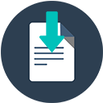

<h1  align='center'>
Paper extension
</h1> 

<h4 align='center'>
A chrome extension to sync the highlighted text from web to a dropbox paper. 
</h4> 

<i align='center'>Take notes without leaving the tab </i>

### Download
- Download the .zip file of extension using the green coloured *Clone or download*  button.
- Extract its content at the desired location.

### Authorize
- Get your *client_id* by following the instructions [here](https://auth0.com/docs/connections/social/dropbox/ "Connect your app to Dropbox") and fill in the "*enter client id*" placeholder in paper.js.

### Install
- Go to Chrome menu and click *Tools* then *Extensions* and toggle the *Developer Mode* ON.
- Click on load *UNPACKED EXTENSION* and select the folder where you've extracted the extension.
- The extension is now installed and ready for use.

### Use
- Click on the paper-extension icon and authorize.
- The extension is active now. Right-click on the selected text and you'll see the *Save to paper* option!

##### Open issues and PRs, feel free to contribute. If this extension helped then do star the repo and share with your friends!
